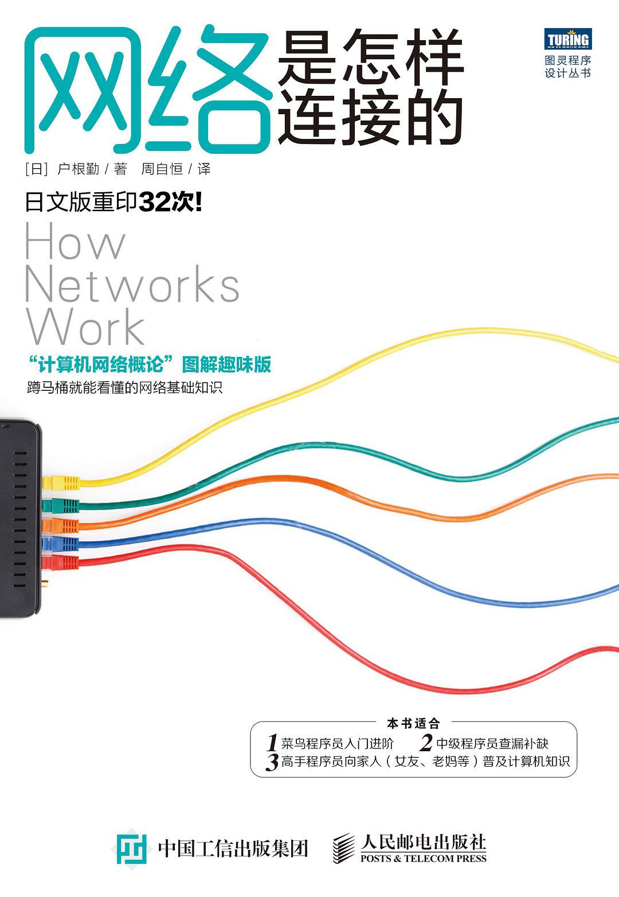
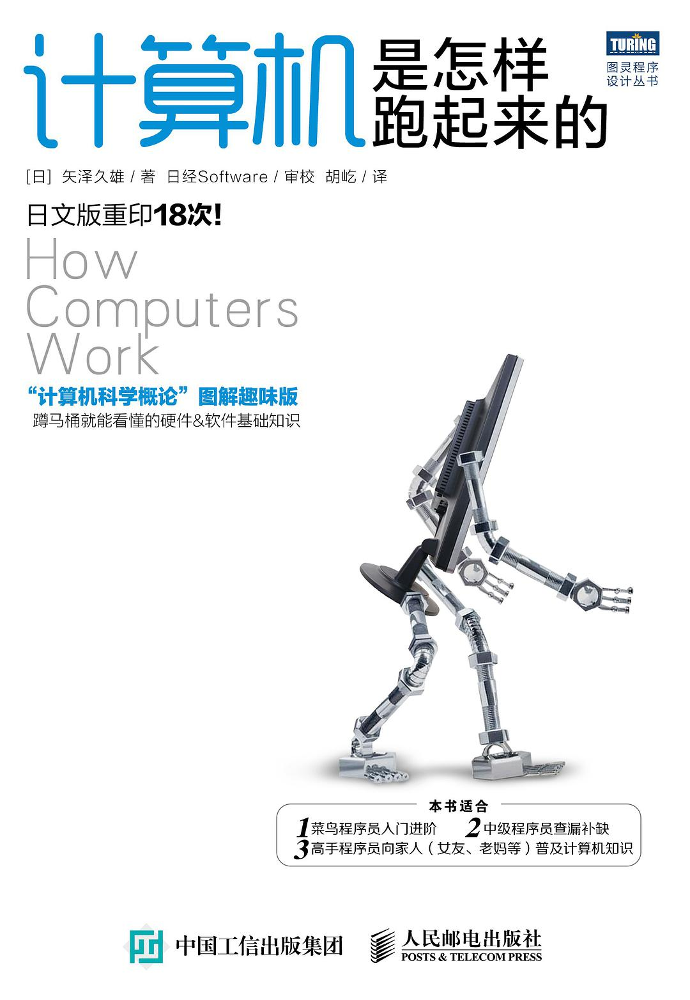
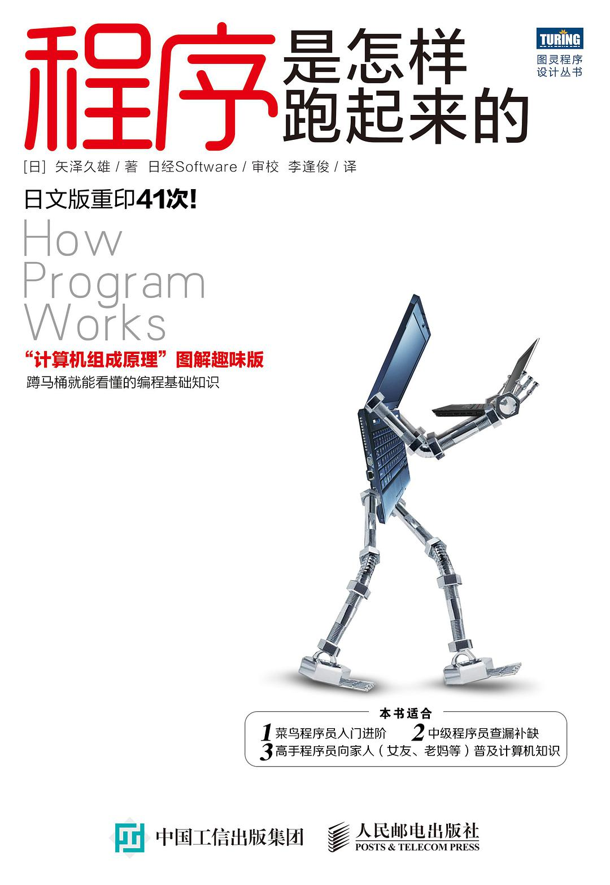
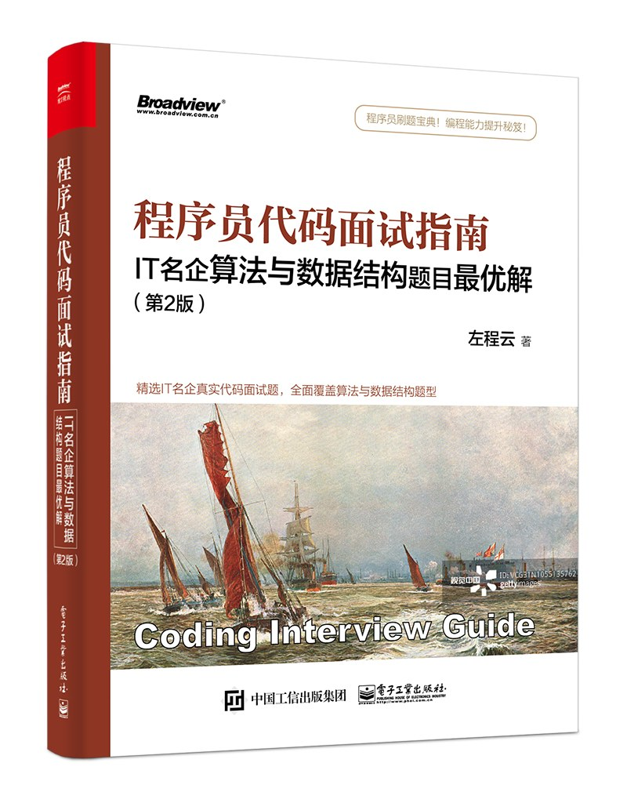
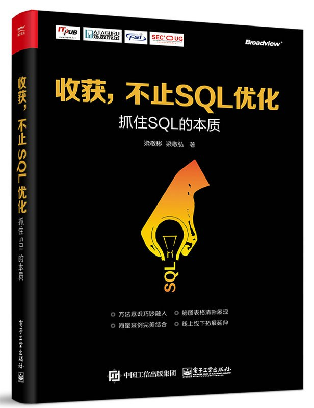
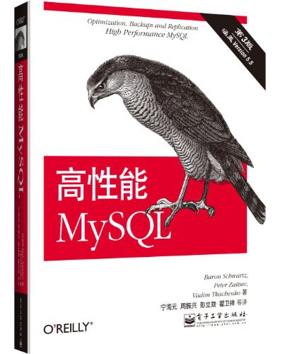

## 前端

|书籍名称|书籍版本|书籍封面|书籍分类|下载链接|详细介绍|
|-|-|-|-|-|-|
|21天学通HTML+CSS+JavaScript Web开发|第7版||综合|[提取码：38j3](https://pan.baidu.com/s/19Ys6k-GnrSRl6a8_BmvoVA)|[豆瓣链接](https://book.douban.com/subject/26960376/)|

## 计算机网络
|书籍名称|书籍版本|书籍封面|下载链接|详细介绍|
|-|-|-|-|-|
|图解TCP/IP|第5版||[提取码：bkj0](https://pan.baidu.com/s/18rbbXVvWJ0mNbmdVCbc85A)|[豆瓣链接](https://book.douban.com/subject/24737674/)|
|网络是怎样连接的|-||[提取码：x6yr](https://pan.baidu.com/s/1ig9GRi9s2kTCL7udgXzOpw)|[豆瓣链接](https://book.douban.com/subject/26941639/)|

## 计算机原理
|书籍名称|书籍版本|书籍封面|下载链接|详细介绍|
|-|-|-|-|-|
|计算机是怎样跑起来的|-||[提取码：05v3](https://pan.baidu.com/s/1e_nUiEwtziWlRrIm4U0JhA)|[豆瓣链接](https://book.douban.com/subject/26397183/)|
|程序是怎样跑起来的|-||[提取码：w0yl](https://pan.baidu.com/s/10DG3WLrzYsvLW1e3dZU46A)|[豆瓣链接](https://book.douban.com/subject/26365491/)|
|编码：隐匿在计算机软硬件背后的语言|-||[提取码：ats9](https://pan.baidu.com/s/1pXPHtmJU-2LlpaaSeMvNVQ)|[豆瓣链接](https://book.douban.com/subject/4822685/)|

## 数据结构与算法
|书籍名称|书籍版本|书籍封面|下载链接|详细介绍|
|-|-|-|-|-|
|算法图解|-||[提取码：5idz](https://pan.baidu.com/s/1hgWgore3nCJfo9na8ee-UA)|[豆瓣链接](https://book.douban.com/subject/26979890/)|
|漫画算法小灰的算法之旅|-||[提取码：xjuk](https://pan.baidu.com/s/1rtKiGKZsQG_TvX3sg2PJsg)|[豆瓣链接](https://book.douban.com/subject/33420587/)|
|程序员代码面试指南：IT名企算法与数据结构题目最优解|-||[提取码：3zzp](https://pan.baidu.com/s/1Pr7luCTgHPSr7sMksBLstA)|[豆瓣链接](https://book.douban.com/subject/30422021/)|

## 数据库
|书籍名称|书籍版本|书籍封面|书籍分类|下载链接|详细介绍|
|-|-|-|-|-|-|
|收获，不止Oracle|第1版||Oracle|[提取码：lqqs](https://pan.baidu.com/s/1jWRAqpzW_4mRyWtMipO_wg)|[豆瓣链接](https://book.douban.com/subject/23857303/)|
|收获，不止SQL优化|-||Oracle|[提取码：4f17](https://pan.baidu.com/s/1YfqlETjtMJNMu6hTbX8ZUg)|[豆瓣链接](https://book.douban.com/subject/27049048/)|
|Redis深度历险：核心原理与应用实践|-||Oracle|[提取码：1elp](https://pan.baidu.com/s/1RtiJeLaK9cVQe2gZGWyz6A)|[豆瓣链接](https://book.douban.com/subject/30386804/)|
|高性能MySQL|第3版||MySql|[提取码：ce39](https://pan.baidu.com/s/1yPlRzT82aD8lT7E1EVzKHA)|[豆瓣链接](https://book.douban.com/subject/23008813/)|